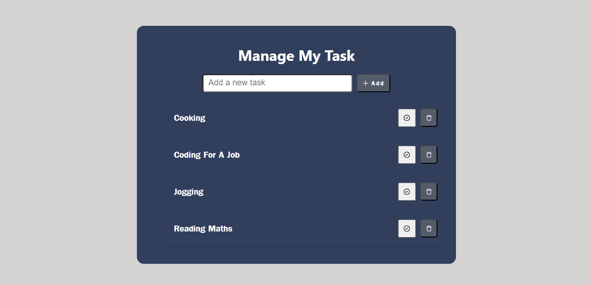

# React ToDo App

This is a simple ToDo application built with React.js that allows users to manage their tasks. Users can add new tasks, mark tasks as complete, and delete tasks. The app uses local storage to persist tasks even after refreshing the page.

## Features

- Add new tasks: Users can add tasks to the list by typing in the task description and pressing "Enter" or clicking the "Add Task" button.

- Mark tasks as complete: Completed tasks can be marked as done by clicking the checkbox next to each task.

- Delete tasks: Users can remove tasks from the list by clicking the "Delete" button next to each task.

- Data persistence: Tasks are stored in the browser's local storage, ensuring that tasks are preserved even after the user refreshes the page or closes the browser.

## Installation

1. Clone the repository to your local machine:

2. Navigate to the project directory:

2. Navigate to the project directory:

3. Install the required dependencies:

4. Start the development server:

5. Open your web browser and visit [http://localhost:3000](http://localhost:3000) to use the ToDo app.

## Usage

- To add a new task, type the task description in the input field and press "Enter" or click the "Add Task" button.

- To mark a task as complete, click the checkbox next to the task. The task will be visually marked as done.

- To delete a task, click the "Delete" button next to the task.

- Tasks are automatically saved to local storage, so you can safely close the browser or refresh the page without losing your tasks.

## Technologies Used

- React.js: A JavaScript library for building user interfaces.
- Local Storage: For data persistence.

## Contributing

Contributions are welcome! If you'd like to contribute to the project, please follow these steps:

1. Fork the repository.
2. Create a new branch for your feature or bug fix.
3. Make your changes and commit them.
4. Push your changes to your fork.
5. Create a pull request to the original repository.

## License

This project is open-source and available under the [MIT License](LICENSE).
